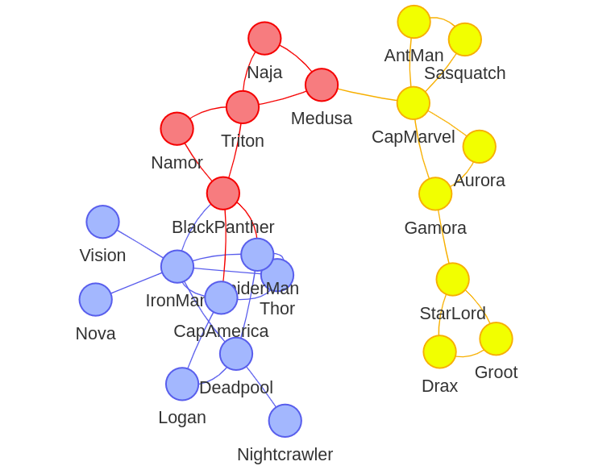

# louvain-modularity-civil-war
Graph community simulation of Marvel's Civil Wars



To visualize the graph just run the program with the following parameters:

```
./ProjetoLouvain ./instancias/civilwar2.net -draw > graph.js
```